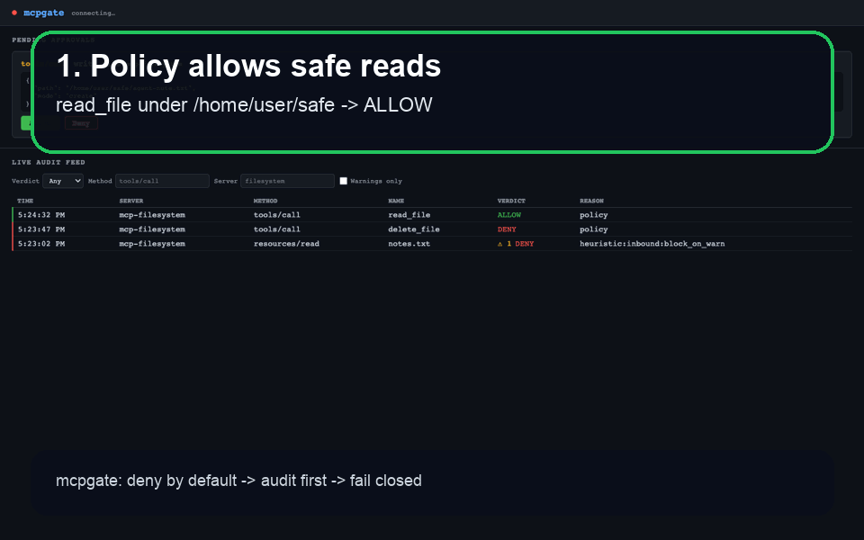
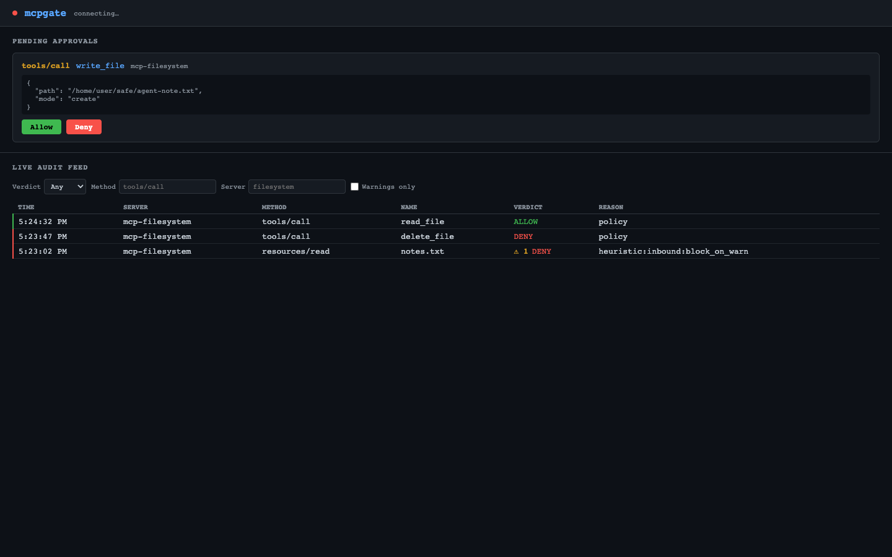

# mcpgate

**Zero-Trust MCP Gateway** — a deny-by-default firewall/proxy for the [Model Context Protocol](https://modelcontextprotocol.io).

mcpgate sits between an AI agent and an MCP server. Every gated `tools/call`, `resources/read`, `prompts/get`, and reverse-channel `sampling/createMessage` is evaluated against a YAML policy before it reaches the other side. Unknown or denied calls are blocked and logged; nothing passes through without an explicit allow decision.

## Showcase demo

The fastest way to understand mcpgate is the showcase flow in [`docs/SHOWCASE.md`](docs/SHOWCASE.md):

1. An agent tries to read a safe file and mcpgate allows it.
2. The same agent tries to write a file and mcpgate parks the call for human approval.
3. A dangerous delete is denied by policy before it reaches the MCP server.
4. Prompt-injection or exfiltration text is flagged in the signed audit trail and can be blocked with `heuristics.block_on_warn`.





## Highlights

- Deny-by-default YAML policy for MCP tools, resources, prompts, and reverse-channel sampling.
- Write-ahead SQLite audit: calls are logged before forwarding, and audit failure denies the call.
- Local browser dashboard for pending approvals and live audit events, including approval-source filtering.
- HMAC-verifiable audit chain export for incident review, including approval source metadata.
- Deterministic prompt-injection/tool-poisoning scanner with optional block-on-warn mode.
- Stdio and HTTP server transports with optional HTTP egress allowlisting.
- One active selected MCP server per gateway process for explicit client routing and audit attribution.

---

## How it works

```
AI Agent (e.g. Claude)
       │  JSON-RPC over stdio
       ▼
  ┌──────────┐
  │ mcpgate  │──── enforce policy ────► allow / deny / ask
  │  proxy   │                              │
  └──────────┘                              │ allow
       │ JSON-RPC over stdio                ▼
       ▼                          ┌─────────────────┐
  MCP Server                      │  SQLite audit DB │
  (filesystem, git, …)            └─────────────────┘
```

1. The agent's stdin/stdout is piped through mcpgate instead of directly to the MCP server.
2. mcpgate connects to the configured MCP server over stdio or HTTP.
3. For every gated method (`tools/call`, `resources/read`, `prompts/get`, and reverse-channel `sampling/createMessage`) the policy engine runs.
4. The verdict (`ALLOW` / `DENY` / `ASK`) is written to a SQLite audit log **before** the call is forwarded.
5. A small HTTP server on `127.0.0.1:18789` exposes the browser dashboard, `/health`, `/approve`, `/pending`, `/audit`, and `/events`.

---

## Quick start

### Prerequisites

- Go 1.21+ (module path: `github.com/maksym-mishchenko/mcpgate`)
- An MCP server binary (e.g. `mcp-filesystem`)

### Install

Download a release archive from <https://github.com/maksym-mishchenko/mcpgate/releases>, extract the `mcpgate` binary for your OS/architecture, and put it on your `PATH`.

Or install with Go:

```bash
go install github.com/maksym-mishchenko/mcpgate/cmd/mcpgate@latest
```

### Create a policy file

```yaml
# mcpgate.yaml
version: 1
mode: enforce
default: "false"

servers:
  filesystem:
    command: ["/usr/local/bin/mcp-filesystem", "--root", "/home/user/safe"]
    tools:
      read_file:
        allow: "true"
        constraints:
          path:
            within: ["/home/user/safe"]
      write_file:
        # ask prompts do not evaluate constraints; approvers must inspect
        # the proposed path before allowing the call.
        allow: ask
      delete_file:
        allow: "false"
    resources:
      allow: "true"

# Injection / tool-poisoning heuristics (v1.1).
heuristics:
  enabled: true          # WARN-only detection (default)
  block_on_warn: false   # set true to deny on a match and withhold poisoned content
```

### Run

```bash
# Set a high-entropy token for the web API (required)
openssl rand -hex 32 > .mcpgate-token

# Run — with a single configured server, mcpgate starts its command from the policy
mcpgate --config mcpgate.yaml --token-file .mcpgate-token
```

Configure your AI client to use mcpgate's stdio instead of the MCP server directly. For example in Claude Desktop's `mcp.json`:

```json
{
  "mcpServers": {
    "filesystem": {
      "command": "mcpgate",
      "args": ["--config", "/path/to/mcpgate.yaml", "--token-file", "/path/to/.mcpgate-token"]
    }
  }
}
```

---

## Policy config reference

```yaml
version: 1           # must be 1
mode: enforce        # "enforce" (block violations) | "observe" (log only, allow all)
default: "false"     # default verdict for unmatched calls: "true" | "false" | "ask"

servers:
  <server-name>:     # choose this name with --server when multiple servers are configured
    command: []      # stdio server command; omit when using url
    url: ""          # HTTP JSON-RPC endpoint; omit when using command
    egress_allow: [] # optional hostname allowlist for HTTP transport
    tools:
      <tool-name>:
        allow: "true" | "false" | ask
        constraints:          # optional; only evaluated when allow is "true"
          path:
            within: ["/allowed/prefix"]   # path must be under one of these roots
            resolve_within: ["/allowed/prefix"] # optional symlink-aware check for existing paths
            equals: "/exact/path"         # path must equal this exactly
            one_of: ["/a", "/b"]          # path must be one of these values
            matches: "regex"              # path must match this anchored regex
          fields:
            mode:
              one_of: ["read", "search"]
            limit:
              min: 1
              max: 100
            include_hidden:
              bool: false
            query:
              matches: "[a-z0-9 _-]+"
    resources:
      allow: "true" | "false" | ask
    prompts:
      allow: true | false
    sampling:
      allow: true | false

heuristics:
  enabled: true        # default when omitted
  block_on_warn: false # opt in to deny and withhold on deterministic scanner matches
```

**Modes:**

| Mode | Behaviour |
|------|-----------|
| `enforce` | `DENY` all calls not explicitly `allow: "true"`. `ask` parks the call for human approval and auto-denies on timeout. |
| `observe` | All calls pass through. Useful for discovering what an agent actually calls. |

**Allow values:**

| Value | Verdict |
|-------|---------|
| `"true"` | Allow (after constraint check) |
| `"false"` | Deny immediately |
| `ask` | Interactive approval through the local browser UI; timeout resolves as deny; constraints are not evaluated for `ask` prompts |

**Constraints:**

| Constraint | Applies to | Behavior |
|---|---|---|
| `path.within` | `arguments.path` | String-level absolute path containment check; no symlink resolution; useful for planned writes or new paths |
| `path.resolve_within` | `arguments.path` | Opt-in `EvalSymlinks` containment check for existing paths; fails closed if the path or root cannot be resolved |
| `path.equals` / `path.one_of` / `path.matches` | `arguments.path` | Exact, enum, or anchored RE2 checks |
| `fields.<name>.equals` / `one_of` / `matches` | JSON string argument | Exact, enum, or anchored RE2 checks |
| `fields.<name>.min` / `max` | JSON number or numeric string argument | Denies on parse/range failure |
| `fields.<name>.bool` | JSON boolean or boolean string argument | Denies on mismatch |

For constraint-evaluated `allow: "true"` rules, missing constrained fields deny the call. Invalid regexes, unparseable numbers, unparseable booleans, unresolved symlinks, and missing `path` values for path-constrained allow rules fail closed. `ask` prompts do not evaluate constraints; approvers must inspect proposed paths manually.

**TOCTOU boundary:** Path checks run before the call is forwarded. The child MCP server performs actual filesystem I/O later, so high-risk deployments should combine mcpgate policy with the MCP server's own root restrictions, read-only mounts where possible, containers, or OS-level permissions.

---

## CLI reference

```
mcpgate [flags] [-- <server-command> [server-args...]]
```

| Flag | Default | Description |
|------|---------|-------------|
| `--config` | `mcpgate.yaml` | Path to policy YAML file |
| `--token` | `$MCPGATE_TOKEN` | Bearer token for web API authentication |
| `--token-file` | `$MCPGATE_TOKEN_FILE` | File containing the web API bearer token; preferred over command-line token values |
| `--audit-key` | `$MCPGATE_AUDIT_KEY_FILE` | 32-byte HMAC key file for signing runtime audit rows |
| `--addr` | `127.0.0.1:18789` | Web server listen address |
| `--approval-timeout` | `30s` | How long an `ask` call waits before auto-deny |
| `--server-timeout` | `60s` | How long mcpgate waits for MCP server responses before failing closed |
| `--server` | `""` | Server name from policy config to run; required when config has multiple servers |

If the policy config defines one server, mcpgate starts that server's `command` or `url`. If it defines multiple servers, pass `--server <name>` to choose one deterministically. The double-dash `--` separator is only needed for the fallback mode where the server command is supplied on the CLI instead of in policy config.

mcpgate intentionally runs one active MCP server per process. For multiple MCP servers, configure one client entry and one mcpgate process per server; share a policy file if that makes operations simpler, but select each server explicitly with `--server`.

Policy decisions are hot-reloaded from `--config` when the policy file modification time changes. Reload failures keep the last valid policy in memory rather than replacing it with a broken config. The selected MCP server transport is startup-only; changing `servers.<name>.command`, `url`, or `egress_allow` requires restarting mcpgate.

### Audit subcommands

```bash
mcpgate export --db mcpgate.db --out audit-review.jsonl
mcpgate verify --file audit-review.jsonl
mcpgate discover --file audit-review.jsonl --out draft-policy.yaml
```

Use `mcpgate keygen audit.key` and run with `--audit-key audit.key` to sign runtime audit rows. Keyed verification requires contiguous sequence numbers and a valid HMAC signature on every row except the bootstrap `seq=1` `GENESIS` row. `discover` converts a verified observe-mode audit export into a conservative `mode: enforce` draft policy. It includes only warning-free `ALLOW` rows, keeps `default: "false"`, and uses placeholder server commands so operators must review transport settings and add path/field constraints before use. See [`docs/AUDIT_REVIEW.md`](docs/AUDIT_REVIEW.md).

---

## Web API reference

All endpoints require authentication. Pass the token as a `Bearer` header or `?token=` query param. Requests from non-localhost `Host` headers are rejected (anti-DNS-rebinding).

Generate and store real dashboard tokens outside the repository. See [`docs/OPERATIONAL_SECRETS.md`](docs/OPERATIONAL_SECRETS.md) for storage and rotation guidance.

### `GET /health`

Returns safe, non-secret runtime status when the gateway is running.

```bash
curl -H "Authorization: Bearer $MCPGATE_TOKEN" http://127.0.0.1:18789/health
```

Example response:

```json
{
  "status": "ok",
  "version": "1.4.2",
  "server": "filesystem",
  "policy": {
    "path": "mcpgate.yaml",
    "mode": "enforce",
    "reload": "hot-last-known-good",
    "heuristics_enabled": true,
    "heuristics_block_on_warn": false
  },
  "audit": {
    "history": true,
    "hmac": true
  },
  "runtime": {
    "pending": 0
  }
}
```

### `GET /pending`

Returns currently parked `ask` calls, so a browser can reconnect without losing pending approvals.

```bash
curl -H "Authorization: Bearer $MCPGATE_TOKEN" http://127.0.0.1:18789/pending
```

### `GET /audit`

Returns the latest 100 audit entries from SQLite, newest first. Approval-related rows include `approval_source` so operators can distinguish policy decisions, human UI decisions, approval timeouts, and heuristic blocks.

```bash
curl -H "Authorization: Bearer $MCPGATE_TOKEN" http://127.0.0.1:18789/audit
```

For long-running deployments, export and verify audit logs before archival or rotation. See [`docs/AUDIT_RETENTION.md`](docs/AUDIT_RETENTION.md).

### `POST /approve`

Resolve a pending `ask` approval.

```bash
curl -X POST -H "Authorization: Bearer $MCPGATE_TOKEN" \
  -H "Content-Type: application/json" \
  -d '{"key":"filesystem:42","verdict":"allow"}' \
  http://127.0.0.1:18789/approve
```

| Field | Values |
|-------|--------|
| `key` | `"<server-name>:<request-id>"` |
| `verdict` | `"allow"` or `"deny"` |

### `GET /events`

Server-Sent Events stream of audit events. Connect with any SSE client.

```bash
curl -N -H "Authorization: Bearer $MCPGATE_TOKEN" http://127.0.0.1:18789/events
```

Events are broadcast as `event: <name>\ndata: <json>\n\n`.

---

## Security model

- **Fail-closed:** Any audit write failure causes the call to be denied. mcpgate never allows a call if it cannot record it.
- **Token authentication:** All web API endpoints require a matching Bearer token. There is no guest mode.
- **Anti-DNS-rebinding:** The `Host` header is checked on every request. Only `localhost` and `127.0.0.1` are accepted, regardless of the token.
- **Deny by default:** Unmatched calls return `DENY` in enforce mode. You must explicitly opt in to allow a tool.
- **Interactive approval:** `ask` calls are parked for approval in the local UI and denied automatically on timeout; audit rows record whether the final decision came from policy, a human, timeout, or heuristic blocking.
- **Prompt-poisoning detection:** Deterministic scanner warnings are signed into the audit chain and can be escalated with `heuristics.block_on_warn`.
- **Process isolation:** stdio MCP servers are spawned with process-group isolation so `SIGTERM`/`SIGKILL` reaches the whole subprocess tree, not just the direct child.
- **One active server per process:** multiplexing is explicit at the MCP client level; each mcpgate process fronts one selected server for simpler routing and audit attribution.

---

## Architecture

```
cmd/mcpgate/       — CLI entry point, flag parsing, wiring
internal/
  policy/          — YAML config types, policy engine (pure function)
  proxy/           — core single-server message loop, verdict dispatch
  audit/           — SQLite write-ahead audit log
  approval/        — coordinator for pending human approvals
  child/           — spawn/stop child MCP server process
  codec/           — newline-delimited JSON-RPC reader/writer
  transport/       — Transport interface (stdio and HTTP implementations)
  web/             — HTTP server (/health, /approve, /pending, /audit, /events)
  jsonrpc/         — minimal JSON-RPC message type
  scanner/         — deterministic injection/exfiltration signatures
```

---

## License

MIT
